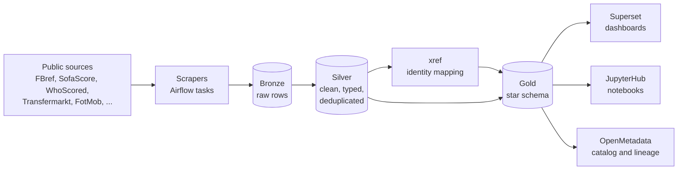

# Data Platform Football

A self-hosted data platform for football (soccer) analytics. It collects match, player and
team data from public sources, stores it in an Apache Iceberg lakehouse and publishes a
star-schema model for BI dashboards, notebooks and a data catalog.

Everything runs on one VM with Docker Compose. Airflow orchestrates the pipelines, and
Trino is the only query and compute engine.

Start with [AGENTS.md](AGENTS.md), the [source/runbook map](docs/operations/README.md),
[test profiles](TESTING.md) and [readiness stages](docs/operations/READINESS.md).
Current work focuses on Bronze; Silver/Gold work needs an explicit task.

## Data sources

FBref, SofaScore, WhoScored, Transfermarkt, FotMob, Understat, ClubElo, ESPN, Capology,
SoFIFA and Football-Data (MatchHistory). Each source has its own scraper package under
`scrapers/<source>/`. Launch paths differ: current ESPN uses
[`deploy/espn/dags/dag_espn_current.py`](deploy/espn/dags/dag_espn_current.py), not the
legacy `dags/dag_ingest_espn.py`. Use the [source map](docs/operations/README.md)
to find each entrypoint, contract and runbook.

## Architecture: Bronze → Silver → Gold



All three layers are Iceberg tables in one warehouse, queried through Trino.

- **Bronze** (`iceberg.bronze.*`) holds raw rows as the source returned them, one table per
  scraper endpoint. Writes are append or partition-replace only. A completeness guard
  refuses to overwrite a partition with a smaller, partial scrape.
- **Silver** (`iceberg.silver.*`) is clean and source-faithful. One Bronze fact becomes one
  Silver fact at the same grain, typed and deduplicated. The **xref** tables map every
  source's own team and player ids to canonical ids per league and season, so sources can
  be joined. A written charter defines what is allowed in Silver, and a static audit
  (`scripts/audit_silver_charter.py`) enforces it in pre-commit.
- **Gold** (`iceberg.gold.*`) is a derived star schema: `dim_*` dimensions (player, team,
  match, competition, season, venue, referee, manager) and `fct_*` facts (player match
  stats, shots, events, lineups, standings, market values, Elo ratings and more).
  Cross-source joins, rollups and features live here.

Transforms are plain `SELECT` files in `dags/sql/silver/` and `dags/sql/gold/`. The runner
wraps each one in an atomic `CREATE OR REPLACE TABLE ... AS SELECT` and applies
partitioning, so a failed run never leaves a half-written table.

## Tech stack

| Area | Tools |
|---|---|
| Orchestration | Apache Airflow 2.11 |
| Query engine | Trino |
| Table format and catalog | Apache Iceberg, Lakekeeper (Iceberg REST catalog) |
| Object storage | SeaweedFS (S3-compatible) |
| Metadata databases | PostgreSQL, Redis |
| Scraping | Python, nodriver / Camoufox browsers, FlareSolverr, metered residential proxies |
| BI and analysis | Apache Superset, JupyterHub |
| Data catalog | OpenMetadata |
| Access | Keycloak (SSO), Caddy (TLS reverse proxy) |
| Deployment and CI | Docker Compose, GitHub Actions |

## Engineering highlights

- **Scrapers are isolated.** Each scraper runs as a separate subprocess, so a browser crash
  or memory spike cannot take down the Airflow scheduler.
- **Proxy traffic is metered.** Paid residential proxy traffic goes through a filtering
  proxy that enforces byte budgets per run and per URL and blocks ad-tech hosts.
- **Data quality gates.** DQ checks run between layers, and a failed check stops the next
  stage from publishing.
- **Idempotent loads.** Deduplication follows one rule everywhere (latest ingested row per
  natural key), so re-running a load gives the same result.

## Repository layout

```
dags/                Airflow DAGs (ingest_* and transform_*) and shared task utilities
dags/sql/silver/     Silver transforms (pure SELECT, optionally Jinja)
dags/sql/gold/       Gold dimensions and facts
scrapers/            One package per source plus the shared base scraper
configs/             Service configs and medallion mappings (team aliases, competitions)
docker/              Custom images (Airflow, Superset, JupyterHub, ...)
scripts/             Operational scripts and the Silver charter audit
transform/           dbt pilot project
tests/               Unit and integration tests
compose.yaml         The full service stack
```

## Running locally

The commands below bootstrap a **new, isolated development stack** with its own
credentials and storage. They are not instructions for the shared production host.
On a shared host, read its stack protocol and verify mounts/configs before any
Compose operation; `make up-lite` must not be used there.

```bash
cp .env.example .env        # then fill in your own passwords and keys
make up-lite                # core services: storage, catalog, Postgres, Redis, Airflow, Trino, Superset
make ps                     # service status
```

Tests run in a separate host venv and development checkout. Follow
[TESTING.md](TESTING.md) for a pinned offline smoke profile, the full unit suite
and integration requirements. Bare `pytest` also selects live tests; a successful
smoke does not replace required CI or source acceptance.
