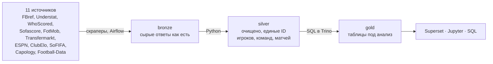

# Football Data Platform

Платформа футбольных данных для авторов статей и аналитиков. Каждый день собирает матчи, события, xG, составы, трансферы и рейтинги из 11 открытых источников, сводит их к единым игрокам, командам и матчам и отдаёт готовые таблицы в SQL, Jupyter и дашборды Superset.

**Что уже есть:** топ-5 лиг за 10 сезонов (2016/17–2025/26) и ЧМ-2026 — 18 тыс. матчей, 28 млн событий, 429 тыс. ударов, 35 аналитических таблиц.

Проект делает один человек — [Сергей Кузнецов](https://t.me/Sergeykuznetsov1995).

## Как устроено

- **Хранилище:** Apache Iceberg на S3-совместимом хранилище, запросы — Trino.
- **Оркестрация:** Airflow — ежедневная загрузка, догрузка пропусков, пересчёт слоёв SQL-скриптами (82 в silver, 46 в gold).
- **Сведение источников:** у каждого сайта свои ID и написание имён; слой сопоставления (`xref`) связывает одного и того же игрока, команду и матч между всеми источниками.
- **Качество данных:** проверки полноты и дублей на каждом слое, алёрты в Telegram при сбоях.
- **Доступ:** единый вход (Keycloak), у пользователей только чтение `silver`/`gold`, их запросы не мешают пайплайнам.

## Что можно посмотреть

| Что | Где |
|---|---|
| Дашборды | `https://bi.sk-vpn-2026.uk` |
| SQL слоёв silver и gold | [`dags/sql/`](dags/sql/) |
| Пайплайны | [`dags/`](dags/) |
| Скраперы источников | [`scrapers/`](scrapers/) |
| Решения и разборы | [`docs/decisions/`](docs/decisions/), [`docs/research/`](docs/research/) |

## Как ведётся разработка

Код пишут ИИ-агенты (Claude Code). Я ставлю задачи, задаю модель данных и проверки и принимаю каждое изменение только через pull request с тестами и ревью. В репозитории ~670 файлов тестов, CI гоняет их на каждом PR.

## Стек

Python · SQL · Airflow · Trino · Apache Iceberg · S3 · Superset · Jupyter · Keycloak · Docker · GitHub Actions
