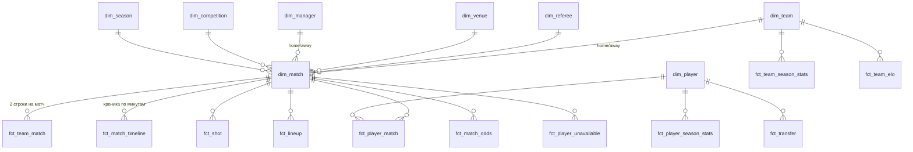

# Gold-слой: дизайн звезды (этаж 1)

> Дата: 2026-06-10 · Статус: дизайн-документ (без привязки к текущему коду)
> Потребитель №1: ML-прогноз исходов матчей. Скоуп данных: АПЛ (5 сезонов), но схема обязана пережить добавление новых лиг без переделки ключей и партиций.

Документ восстановлен в Git из существующего проектного дизайна 07.10.2026.
Перечни таблиц и источников ниже описывают дизайн, не текущую готовность production.
Он не разрешает включать или перестраивать Gold: объём задаётся текущей задачей.
Для реализации сверяй потребителей и действующий [Silver charter](../decisions/silver-charter.md).

Этот документ описывает **только первый этаж** gold-слоя — «звезду»: справочники (`dim_*`) и факты (`fct_*`).
Этажи 2 (фичи) и 3 (ML-витрины) — отдельные документы, здесь они упомянуты одним абзацем в конце.

---

## 1. Теория за пять минут

> 💡 **Звезда (star schema).** Все таблицы делятся на два сорта.
> **Справочники (dim)** — «кто и что существует»: игрок, команда, судья, стадион. Как телефонная книга: одна строка = один объект, в колонках его свойства.
> **Факты (fct)** — «что произошло и с какими цифрами»: матч сыгран 2:1, удар с xG 0.31, жёлтая на 67-й минуте. Каждый факт ссылается на справочники через ID.
> На схеме факт в центре, справочники вокруг лучами — поэтому «звезда».

> 💡 **Грейн (grain).** Самое важное слово в дизайне. Грейн = «одна строка этой таблицы — это что?». Пока не сказал грейн вслух, таблицу проектировать нельзя. У каждой таблицы ниже грейн написан первой строкой.

> 💡 **Правило раскладывания.** Свойство **редко меняется** (имя, дата рождения, страна) → в справочник. Свойство **случается** (голы, удары, минуты) → в факт. Если сомневаешься, спроси: «у этого есть дата события?» Есть — значит факт.

> 💡 **Ключи.** Все ID — канонические, из `silver.xref_*`: один игрок = один `player_id`, под каким бы именем его ни писали 7 источников («Son Heung-min» / «Heung-Min Son» / «손흥민» → один ID). Факты несут **внешние ключи** (FK) на справочники — именно это позволяет «поджойнить тренеров, судей и т.д.» одним JOIN.

> 💡 **FK здесь «мягкие».** Iceberg/Trino не умеют настоящие FOREIGN KEY — целостность (каждый `referee_id` из факта существует в `dim_referee`) проверяется DQ-чеками после сборки, а не базой.

---

## 2. Карта звезды



Состав: **8 справочников + 17 фактов** (3 блока: матчевый, сезонный, «вне поля»).

| Блок | Таблицы |
|---|---|
| Справочники | dim_player, dim_team, dim_match, dim_referee, dim_manager, dim_venue, dim_competition, dim_season |
| Матчевый | fct_team_match, fct_match_timeline, fct_shot, fct_player_match, fct_lineup, fct_player_unavailable, fct_match_odds |
| Сезонный | fct_player_season_stats, fct_keeper_season_stats, fct_team_season_stats, fct_standings |
| Вне поля | fct_manager_stint, fct_transfer, fct_player_salary, fct_player_market_value, fct_player_fifa_rating, fct_team_elo |

---

## 3. Справочники (dim)

### 3.1 dim_player — игрок

- **Грейн:** одна строка = один игрок (за всю историю, без сезона в ключе).
- **PK:** `player_id` (canonical из `silver.xref_player`).
- **Колонки:** `player_name`, `dob` (дата рождения), `nationality`, `height_cm`, `preferred_foot`, `primary_position`.
- **Источники:** FBref-профиль как позвоночник + обогащение из FotMob/SofaScore/Transfermarkt/SoFIFA.

> 💡 Возраст и текущая команда здесь **не хранятся** — они меняются. Возраст считается из `dob` на дату матча; команда видна из `fct_lineup` / `fct_player_season_stats`. Справочник хранит только то, что у игрока «навсегда».

### 3.2 dim_team — команда

- **Грейн:** одна строка = один клуб.
- **PK:** `team_id` (canonical slug из `silver.xref_team` / `team_aliases.yaml`).
- **Колонки:** `team_name`, `country`, `short_name`.
- В каких лигах и сезонах команда играла — видно из `fct_team_season_stats` и `fct_standings`, не отсюда (вылеты/выходы — это события).

### 3.3 dim_match — матч (центр звезды)

- **Грейн:** одна строка = один матч.
- **PK:** `match_id` (canonical из `silver.xref_match`, FBref hex — позвоночник).
- **FK:** `home_team_id`, `away_team_id` → dim_team; `referee_id` → dim_referee; `venue_id` → dim_venue; `home_manager_id`, `away_manager_id` → dim_manager; `league` → dim_competition; `season` → dim_season.
- **Колонки-контекст:** `match_date`, `kickoff_time`, `gameweek`, `attendance`, `home_score`, `away_score`, `result_1x2` (H/D/A), `is_completed`.
- **Источники:** `silver.fbref_match_enriched` (дата, счёт, судья, стадион, посещаемость) + `bronze.fbref_match_managers` (тренеры) + `silver.fotmob_match_referee` (страна судьи через xref).

> 💡 Матч — одновременно и «событие» (можно было бы сделать фактом), и «контекст» для всех остальных фактов. Мы выбираем второе: dim_match — справочник-«паспорт матча» (кто, где, когда, кто судил), а вся **статистика** вынесена в `fct_team_match`. Так каждый факт ниже джойнится к одному паспорту, и именно здесь живут все ID, которые ты просил: судья, тренеры, стадион.

### 3.4 dim_referee — судья

- **Грейн:** одна строка = один судья.
- **PK:** `referee_id` (canonical из `silver.xref_referee` — слито 3 источника: FBref, MatchHistory, FotMob).
- **Колонки:** `referee_name`, `country` (есть только у FotMob), `first_seen_date`, `last_seen_date`.

### 3.5 dim_manager — тренер

- **Грейн:** одна строка = один тренер.
- **PK:** `manager_id` (canonical из `silver.xref_manager`: FBref + FotMob).
- **Колонки:** `manager_name`, `nationality` (если есть), `dob` (если есть).
- **История работы** («кто когда тренировал какую команду») — НЕ здесь, а в `fct_manager_stint` (см. 5.1).

### 3.6 dim_venue — стадион

- **Грейн:** одна строка = один стадион.
- **PK:** `venue_id` (slug из `configs/medallion/venue_aliases.yaml`; для нераспознанных — orphan-хэш).
- **Колонки:** `venue_name`, `city`, `country`, `capacity` (если знаем).

### 3.7 dim_competition — лига/турнир

- **Грейн:** одна строка = одна лига.
- **PK:** `league` (slug, напр. `ENG-Premier League`).
- **Колонки:** `competition_name`, `country`, `tier`.
- **Источник:** `configs/medallion/competitions.yaml` — справочник рендерится из конфига, не из данных.

### 3.8 dim_season — сезон

- **Грейн:** одна строка = один сезон.
- **PK:** `season` (slug `'2425'` = август 2024 → май 2025).
- **Колонки:** `season_name` (`2024-25`), `start_date`, `end_date`, `is_current`.

> 💡 Лига и сезон — крошечные справочники (десятки строк), но они делают схему мульти-лиговой: каждый факт несёт пару `(league, season)`, и добавление Ла Лиги — это новые строки в конфиге, а не новые таблицы.

---

## 4. Матчевый блок фактов

### 4.1 fct_team_match — вся статистика команды в матче

Это ответ на «хочу видеть всю статистику по матчу».

- **Грейн:** одна строка = одна команда в одном матче (→ ровно 2 строки на матч).
- **PK:** `(match_id, team_id)`. **FK:** match_id → dim_match, team_id → dim_team, `opponent_id` → dim_team.
- **Колонки (группами):**
  - контекст: `is_home`, `league`, `season`;
  - результат: `goals_for`, `goals_against`, `points`;
  - удары: `shots`, `shots_on_target`, `shots_in_box`, `big_chances`;
  - ожидаемые метрики: `xg`, `npxg`, `xga`, `xgot`, `xa`;
  - владение/пасы: `possession_pct`, `passes`, `pass_accuracy_pct`, `touches_in_box`, `deep_completions`;
  - прессинг/оборона: `ppda`, `tackles`, `interceptions`, `clearances`, `ball_recoveries`;
  - дуэли: `ground_duels_won_pct`, `aerial_duels_won_pct`;
  - дисциплина/стандарты: `fouls`, `yellow_cards`, `red_cards`, `corners`.
- **Источники:** FBref — позвоночник; xG/PPDA/deep — Understat (первичен по xG); дуэли — SofaScore; big chances, touches_in_box, xGOT — FotMob; SPADL-производные — WhoScored. Слияние через `COALESCE` с фиксированным приоритетом.

> 💡 **Почему 2 строки на матч, а не 1 широкая (home_*/away_*)?** В «длинном» виде вопрос «сколько в среднем бьёт Арсенал» — это `WHERE team_id='arsenal'`, одна строка на матч. В широком виде пришлось бы каждый раз думать, дома он играл или в гостях, и дублировать каждую метрику двумя колонками. Широкая форма (одна строка = матч, фичи обеих команд) появится на 3-м этаже — для модели, не для людей.

### 4.2 fct_match_timeline — хроника матча

Твоя «вторая таблица»: что случилось и на какой минуте.

- **Грейн:** одна строка = одно событие матча.
- **PK:** `(match_id, event_seq)` — `event_seq` = порядковый номер события внутри матча (1, 2, 3…).
- **FK:** match_id → dim_match, `team_id` → dim_team, `player_id` → dim_player, `related_player_id` → dim_player.
- **Колонки:**
  - время: `period` (1H/2H/ET), `minute`, `minute_added` (90+4 → minute=90, added=4);
  - `event_type` — словарь: `goal`, `own_goal`, `penalty_goal`, `penalty_missed`, `yellow_card`, `second_yellow`, `red_card`, `substitution`;
  - участники: `player_id` (главный — забил/получил/ушёл), `related_player_id` (ассистент при голе, вышедший при замене);
  - `score_home_after`, `score_away_after` — счёт после события (удобно читать хронику и считать «играя в счёте»).
- **Источники:** `silver.fbref_match_events` (первичен) + `bronze.whoscored_events` (fallback) через xref_match/xref_player.

> 💡 **Один таймлайн или отдельные таблицы (голы/карточки/замены)?** Мы выбираем **единый таймлайн**: вопрос «что произошло в матче по минутам» отвечается одним `SELECT … ORDER BY event_seq`, без UNION из трёх таблиц. Цена — у разных типов событий заполнены разные колонки (у замены нет ассистента, у карточки нет счёта-изменения) — это нормально, NULL там, где атрибут не применим. А вот **удары** живут отдельно (4.3): их сильно больше, чем «событий хроники», и у них своя физика (координаты, xG) — смешивать грейны нельзя.

### 4.3 fct_shot — удары

- **Грейн:** одна строка = один удар.
- **PK:** `(match_id, shot_id)`. **FK:** match_id, `team_id`, `player_id`, `assist_player_id`.
- **Колонки:** `minute`, `x`, `y` (нормированные координаты), `body_part`, `situation` (open_play / corner / free_kick / penalty / set_piece), `xg`, `psxg` (post-shot, если есть), `result` (goal / saved / blocked / off_target / post / own_goal — own_goal добавлен в #426: Understat размечает автоголы отдельным result, на нём держится атрибуция бьющего; схлопывание в goal исказило бы статистику игрока).
- **Источники:** `bronze.understat_shots` (первичен — лучшая доступная xG-модель) + `silver.fbref_shot_events`.

### 4.4 fct_player_match — игрок в матче

«То же самое с игроками» на матчевом грейне.

- **Грейн:** одна строка = один игрок в одном матче (если выходил на поле или был в заявке).
- **PK:** `(match_id, player_id)`. **FK:** match_id, player_id, `team_id`.
- **Колонки:** `minutes_played`, `goals`, `assists`, `shots`, `shots_on_target`, `xg`, `xa`, `key_passes`, `passes`, `pass_accuracy_pct`, `tackles`, `interceptions`, `duels_won`, `touches`, `dispossessed`, `fouls_committed`, `fouls_drawn`, `yellow_cards`, `red_cards`, `rating` (SofaScore первичен).
- **Источники:** FBref — позвоночник; SofaScore (rating, дуэли), Understat (xG/xA), WhoScored — обогащение.

### 4.5 fct_lineup — составы

- **Грейн:** одна строка = один игрок в заявке одного матча.
- **PK:** `(match_id, player_id)`. **FK:** match_id, player_id, `team_id`.
- **Колонки:** `is_starter`, `position` (на этот матч), `jersey_number`, `is_captain`.
- **Источники:** `silver.fbref_match_lineups` + `silver.espn_lineup` (fallback).

> 💡 fct_lineup и fct_player_match похожи, но это разные вещи: lineup — **намерение тренера до матча** (известно за час до игры — важно для прогноза!), player_match — **что игрок сделал по факту**. Не склеиваем.

### 4.6 fct_player_unavailable — травмы и дисквалификации

- **Грейн:** одна строка = один недоступный игрок на один матч.
- **PK:** `(match_id, player_id)`. **FK:** match_id, player_id, `team_id`.
- **Колонки:** `reason` (injury / suspension / other — other добавлен в #426: WhoScored несёт также метки other/ineligible, не сводимые к травме или дисквалификации), `detail` (текст источника).
- **Источник:** `silver.whoscored_player_unavailable` (только подтверждённые «Out», без «Doubtful»).

### 4.7 fct_match_odds — букмекерские коэффициенты

- **Грейн:** одна строка = один букмекер × один рынок × один матч × (открытие|закрытие).
- **PK:** `(match_id, bookmaker, market, is_closing)`. **FK:** match_id.
- **Колонки:** `market` (`1x2` / `ah` / `ou_2_5`), `odds_home`, `odds_draw`, `odds_away`, `ah_line`, `ou_line`, `is_closing`.
- **Источник:** `silver.matchhistory_match_odds` (6 букмекеров + AVG/MAX, ~12 строк на матч).

> 💡 **Зачем odds в gold, если мы сами хотим прогнозировать?** Две причины. (1) Коэффициенты — это «прогноз рынка», самый сильный бесплатный бейзлайн: если твоя модель не точнее закрывающей линии — она пока не модель. (2) Имплайд-вероятности из коэффициентов — сами по себе сильная фича. «Длинный» формат (строка на букмекера) вместо широкого — чтобы добавление 7-го букмекера было новыми строками, а не новыми колонками.

---

## 5. Сезонный блок и «вне поля»

### 5.1 fct_manager_stint — история работы тренеров

- **Грейн:** одна строка = один период работы тренера в одной команде («стинт»).
- **PK:** `(manager_id, team_id, valid_from)`. **FK:** manager_id, team_id.
- **Колонки:** `valid_from`, `valid_to` (NULL = работает сейчас), `is_current`, `matches_in_charge`.
- **Источник:** выводится из последовательности матчей `bronze.fbref_match_managers` (граница стинта = смена фамилии у команды).

> 💡 Это «трудовая книжка»: у Арсенала тренеры меняются, и для матча 2023 года нужно знать, кто тренировал **тогда**, а не сейчас. Таблица интервалов `valid_from/valid_to` (приём называется SCD-2) отвечает на это одним JOIN: `match_date BETWEEN valid_from AND COALESCE(valid_to, сегодня)`. Заодно даёт фичу «дней с момента смены тренера».

### 5.2 fct_player_season_stats / 5.3 fct_keeper_season_stats

- **Грейн:** одна строка = один игрок в одной лиге в одном сезоне.
- **PK:** `(player_id, league, season)`. **FK:** player_id, `team_id` (клуб, за который сыграл больше всего минут).
- **Колонки (полевые):** matches, minutes, goals, assists, xg, xa, npxg, xg_chain, xg_buildup, shots, key_passes, tackles, interceptions, per-90 производные, rating.
- **Колонки (вратарские, отдельная таблица):** saves, save_pct, goals_against, ga90, clean_sheets, psxg_minus_ga, pk_faced/saved.
- **Источники:** FBref season-профили — позвоночник; FotMob/SofaScore/Understat/WhoScored — обогащение.

> 💡 Вратари получают свою таблицу, потому что 90% их метрик не существуют у полевых (и наоборот). Запихнуть всё в одну — получить таблицу, где половина колонок всегда NULL.

### 5.4 fct_team_season_stats

- **Грейн:** одна строка = одна команда в одной лиге в одном сезоне.
- **PK:** `(team_id, league, season)`.
- **Колонки:** matches, wins/draws/losses, goals_for/against, xg_for/against, possession_avg, ppda_avg + финансовый блок (суммарная зарплатная ведомость из Capology, суммарная рыночная стоимость состава из Transfermarkt).

### 5.5 fct_standings — турнирная таблица

- **Грейн:** одна строка = одна команда в таблице лиги-сезона (снапшот).
- **PK:** `(league, season, team_id)`.
- **Колонки:** `position`, `points`, `played`, `won/drawn/lost`, `goals_for/against`, `goal_diff`.
- **Источник:** silver (SofaScore league table).
- **Ограничение (честно):** это снапшот «на сейчас», а не по турам. Для point-in-time фич («какое место занимала команда перед 19-м туром») на 2-м этаже таблица будет реконструироваться из `fct_team_match` кумулятивно — источник по турам не нужен.

### 5.6 fct_transfer — трансферы

- **Грейн:** одна строка = один переход игрока.
- **PK:** `(player_id, transfer_date, from_team_id, to_team_id)`. **FK:** player_id, from_team_id, to_team_id.
- **Колонки:** `fee_eur`, `market_value_at_transfer_eur`, `is_loan`, `is_upcoming`.
- **Источник:** `silver.transfermarkt_transfers`. Часть игроков (≈10%, в основном молодёжь) не маппится в canonical — оставляем строки с orphan-ID, не выбрасываем.

### 5.7 fct_player_salary — зарплаты

- **Грейн:** одна строка = один игрок в одном сезоне.
- **PK:** `(player_id, league, season)`.
- **Колонки:** `weekly_gross_eur`, `annual_gross_eur` (+ gbp/usd), `contract_status`, `is_verified`.
- **Источник:** `silver.capology_player_salaries` (покрытие пока только АПЛ).

### 5.8 fct_player_market_value — история рыночной стоимости

- **Грейн:** одна строка = одна оценка одного игрока на одну дату.
- **PK:** `(player_id, valuation_date, source)`.
- **Колонки:** `market_value_eur`, `source` (`transfermarkt` | `fotmob`).

> 💡 Два источника оценивают по-разному — храним оба с колонкой `source`, а не выбираем «правильный» на этом этаже. Выбор первичного источника — решение фичей (этаж 2), не хранения.

### 5.9 fct_player_fifa_rating — игровые рейтинги EA

- **Грейн:** одна строка = один игрок в одном издании FIFA/FC.
- **PK:** `(player_id, fifa_edition)`.
- **Колонки:** `overall`, `potential`, `pace`, `shooting`, `passing`, `dribbling`, `defending`, `physical`, вратарские `gk_*`, `value_eur`, `wage_eur`.
- **Источник:** `silver.sofifa_player_profile`. Это «мнение скаутов EA» — дешёвый прокси качества игрока, выходит раз в год.

### 5.10 fct_team_elo — внешний рейтинг силы команд

- **Грейн:** одна строка = одна команда на одну дату.
- **PK:** `(team_id, elo_date)`.
- **Колонки:** `elo`, `rank`.
- **Источник:** ClubElo (silver). Классическая фича силы команды, обновляется после каждого тура.

---

## 6. Сквозные правила (применяются ко всем таблицам)

1. **Нейминг:** `dim_*` / `fct_*`, snake_case, ID-колонки оканчиваются на `_id`. Деньги — в евро (`*_eur`), проценты — `*_pct`, per-90 — `*_per90`.
2. **Ключи:** только канонические ID из `silver.xref_*`. Нераспознанные сущности получают orphan-ID (с префиксом источника) — строки данных не теряются никогда; доля orphan'ов мониторится DQ.
3. **Мульти-лига:** каждая фактовая таблица несёт `(league, season)`; они входят в PK сезонных фактов и в партиционирование. Добавление лиги = новые строки, ноль изменений схемы. В JOIN'ах через xref пара `(league, season)` обязательна в предикате (иначе размножение строк).
4. **Сезон:** везде varchar-slug `'2425'`. Никаких int-годов.
5. **Партиционирование:** факты — по `(league, season)`; исключения: справочники и мелкие таблицы (elo, market value) — без партиций; всё, что про судей — только по `season` (судьи ходят между лигами).
6. **Слияние источников:** FBref — позвоночник (его ID и состав строк первичны), остальные обогащают через `COALESCE` с фиксированным приоритетом по метрике (xG: Understat → FotMob → SofaScore; rating: SofaScore → WhoScored). Расхождения источников по «жёстким» фактам (голы, минуты) — не в бизнес-таблицах, а в отдельных `*_audit` (WARNING-only).
7. **Никакой агрегации в Silver:** всё, что свёрнуто по матчам/сезонам или склеено из двух источников — это gold. Silver только чистит и приводит к одному виду (см. `docs/decisions/silver-charter.md`).
8. **DQ после сборки:** уникальность PK, «мягкая» ссылочная целостность fct → dim, пороги orphan rate.

---

## 7. Порядок построения (зависимости)

```
1. Справочники без зависимостей: dim_competition, dim_season, dim_venue (из конфигов)
2. Справочники из xref:          dim_player, dim_team, dim_referee, dim_manager
3. Центр:                        dim_match  (нужны все справочники шага 1–2)
4. Матчевый блок:                fct_team_match, fct_match_timeline, fct_shot,
                                 fct_player_match, fct_lineup, fct_player_unavailable, fct_match_odds
5. Сезонный блок и «вне поля»:   fct_*_season_stats, fct_standings, fct_manager_stint,
                                 fct_transfer, fct_player_salary, fct_player_market_value,
                                 fct_player_fifa_rating, fct_team_elo
6. DQ-валидация всего слоя
```

---

## 8. Что дальше (этажи 2–3, вне этого документа)

На этой звезде строятся: **этаж 2** — point-in-time фичи (форма за L5 матчей, H2H, усталость, «дней после смены тренера», имплайд-вероятности из odds); **этаж 3** — широкая матрица «одна строка = матч» + train/test сплиты для модели. Ключевое правило этажа 2 — для матча использовать только данные, известные **до** его начала; звезда это поддерживает тем, что каждый факт датирован и привязан к `match_id`/`date`.
